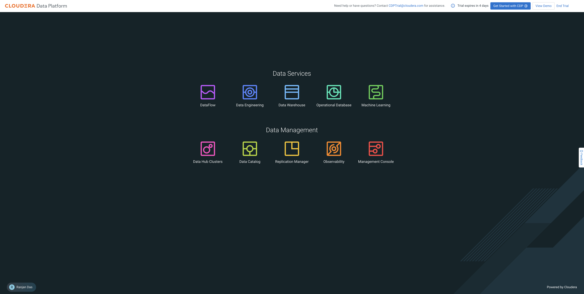

# CDP Public Cloud Trials

Welcome to CDP!

This instruction manual helps you to navigate through CDP Public Cloud Trials.

CDP Public Cloud Trials is based on use cases that you use most often - 

- [**Open Data Lakehouse**](https://github.com/cdp-trial-patterns/opendatalakehouse) - This trial aims at providing a high-level overview of how to use the CDP Public Cloud service to quickly upload data, explore raw data, create curated versions of the data for simple reporting and dashboarding, and then run a machine learning prediction use-case. It highlights the ease of use and automation capabilities that help ensure business objectives are met.
- Coming Soon : **Data Distribution with Data Flow** - This trial outlines steps to implement streaming data ingestion use cases. It includes connecting to streaming data sources, perform in-stream routing, filtering and enrichment. Data is then delivered to diverse destinations such as Data Lakehouse powered by Apache Iceberg and Apache Kafka

### Start your Trial

- Go to trial URL provided in your email, click on the use case you want to try (_**Try All In One Open Data Lakehouse**_ for Open Data Lakehouse pattern)

- If you are already registered with Cloudera, use your email to login, else Register your email by clicking **Register Now** 

Note : Your email will already be added to the include list of Trials by your point of contact at Cloudera, if not, please reach out to your point of contact or send an email to cdptrial@cloudera.com. You will not be able to use Trials if your email or your organization's domain is not in the include list of Trials. You will still need to register with Cloudera verifying your email.

- Once you login, you will be taken to your Trial Home Page. 
  - Click **Start Trial** to go to CDP
  - Click **View Demo** to go to Tutorials to use different features of CDP with regard to Open Data Lakehouse use case
  - Click **Get Started with CDP** to request deployment of CDP in your Cloud
  - Click **End Trial** 
    - Click **Request Extension** to extend beyond 5 days
    - Click **Get Started with CDP** to request deployment of CDP in your Cloud
    - Click **End Trial** to end your Trial

- Click **Start Trial** to go to CDP Public Cloud Home Page (Note the Trial Header on top). 

- Services specific to your pattern will be available in the Trial. Try CDP and reach out to us at cdptrial@cloudera.com for any questions!

